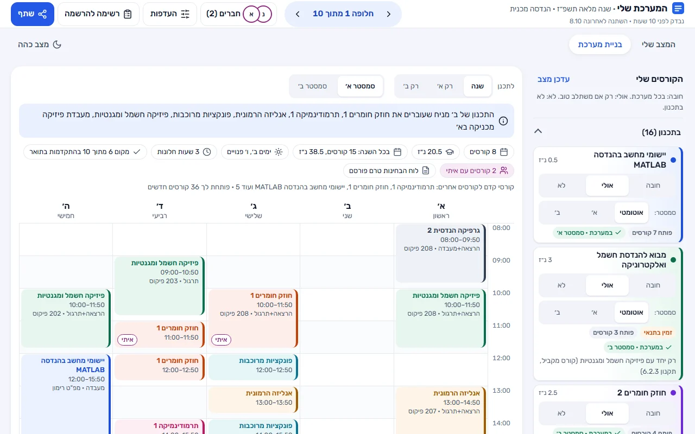
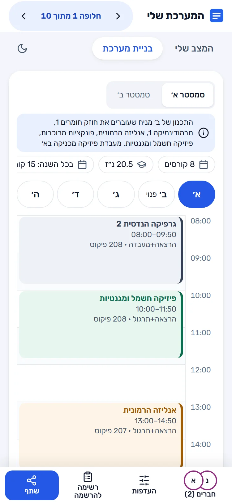
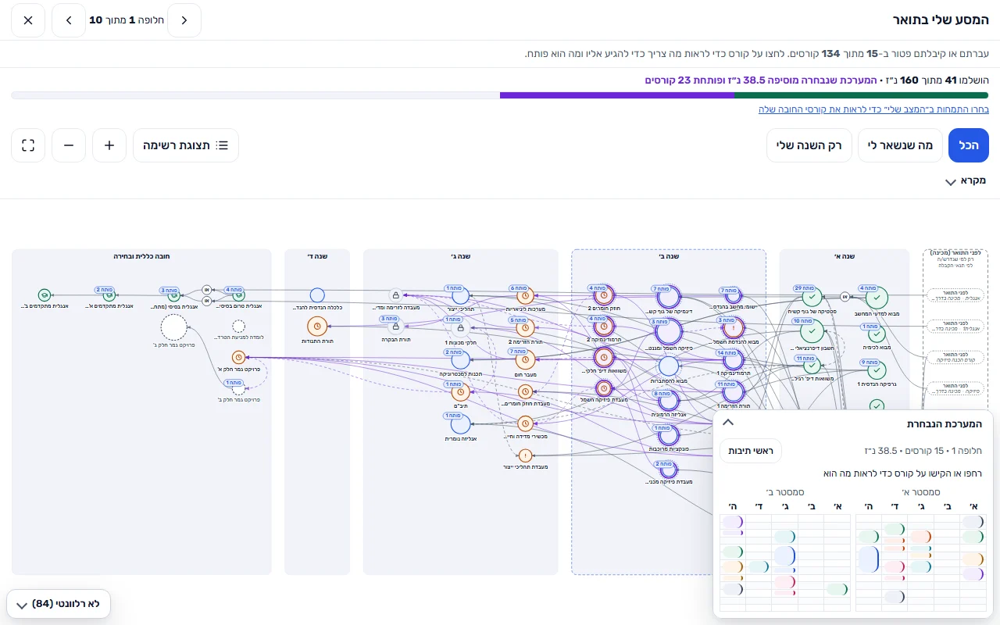
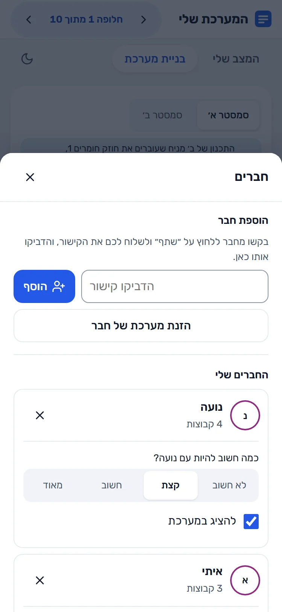
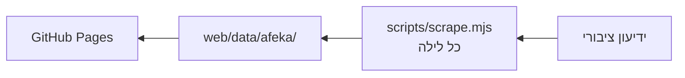

<div dir="rtl" lang="he">
<div align="center">

# המערכת שלי

**בונים מערכת שעות לאפקה: בוחרים קורסים ומקבלים עד 10 מערכות מוכנות, בלי חפיפות.**

**[לפתיחת האתר ←](https://dolev-benezri.github.io/lets_learn/)**

[](https://github.com/dolev-benezri/lets_learn/actions/workflows/deploy.yml)
[](https://dolev-benezri.github.io/lets_learn/)


<picture>
  <source media="(prefers-color-scheme: dark)" srcset="docs/media/01-week-desktop-dark.webp">
  
</picture>

</div>

> **כלי לא רשמי של סטודנטים, ללא קשר למכללת אפקה.** הנתונים מהידיעון הציבורי ויכולים להיות שגויים או לא מעודכנים, ולכן ההרשמה באפקה-נט היא הקובעת. [תנאי שימוש ופרטיות](https://dolev-benezri.github.io/lets_learn/legal.html)

## מה זה עושה

### מערכות מוכנות, בלי לשבץ ביד

אתם קובעים מה חשוב לכם (ימים פנויים, בלי חלונות, שעות נוחות, להיות עם חברים) ומקבלים עד 10 מערכות מדורגות, מהטובה לפחות טובה. אפשר לתכנן שנה שלמה, סמסטר אחד או קיץ, ולנעוץ קבוצה שאתם רוצים בכל מקרה. בטלפון רואים יום אחד בכל פעם, ובמצב כהה או בהיר.

<p align="center">
<picture>
  <source media="(prefers-color-scheme: dark)" srcset="docs/media/02-week-phone-dark.webp">
  
</picture>
</p>

### לפי התקנון והמצב שלכם

**נכשלתם בקורס? גם קורסי ההמשך שלו נחסמים.** מסמנים מה עברתם ומה לא (או מייבאים גיליון ציונים), והכלי מחשב את דרישות הקדם, הקורסים המקבילים והחזרה על קורסים. מפת ההתקדמות מראה את כל התואר בתמונה אחת, ומה כל חלופה עושה לו.

<picture>
  <source media="(prefers-color-scheme: dark)" srcset="docs/media/03-map-desktop-dark.webp">
  
</picture>

### עם חברים

מוסיפים חבר בקישור שהוא שלח, בהדבקת טקסט, מקובץ PDF או מתמונה של המערכת שלו (הזיהוי נעשה בדפדפן שלכם). שיעור משותף מסומן בלוח, והחיפוש מעדיף מערכות עם יותר שיעורים משותפים.

<p align="center">

</p>

## איך מתחילים

1. נכנסים [לאתר](https://dolev-benezri.github.io/lets_learn/) ובוחרים תוכנית, יום או ערב, ושנת לימודים.
2. מסמנים אילו קורסים עברתם או נכשלתם בהם, או מייבאים גיליון ציונים.
3. ב"הקורסים שלי" בוחרים לכל קורס חובה, אולי או לא. המערכות נבנות מיד.
4. מדפדפים בין החלופות עם החצים בראש הלוח. לחיצה על שיעור פותחת פרטים ונעיצה.
5. בסוף פותחים את "רשימה להרשמה" ומעתיקים אותה לאפקה-נט.

## עוד יכולות

<details>
<summary>כל היכולות</summary>

- **מה חשוב לכם:** חברים, ימים פנויים, בלי חלונות, שעות נוחות ופיזור בחינות, כל אחד בארבע דרגות.
- **מה חייב להיות:** יום חופש, טווח שעות, מספר מרבי של ימים בקמפוס, או מרצה מסוים (או בלעדיו).
- **השוואה:** מחלופה 2 והלאה מופיעה שורה "לעומת חלופה 1" עם ההבדלים.
- **שנה מלאה:** זוג מערכות לסמסטר א׳ וב׳, כשקורס מא׳ פותח את ההמשך שלו בב׳. סמסטר קיץ נתמך ונספר.
- **אזהרות לפי התקנון:** כשהממוצע או מספר הכישלונות מסכנים אתכם (לימודים על תנאי, הרחקה).
- **אנגלית:** אם ציון האמירנט שלכם מספיק, קורסי האנגלית מסומנים כפטור.
- **התמחויות:** בחירת התמחות בשנה ג׳ לפי הכלל של המחלקה.
- **רשימת תיוג לסיום התואר:** ב"המצב שלי", כמה נ״ז נשארו בכל דרישה.
- **מפת ההתקדמות:** זום וגרירה, מעבר בין חלופות בלי לאבד את הזום, וראשי תיבות לכל קורס.
- **ייצוא ליומן:** קובץ `.ics` בלי שיעורים בחגים.
- **קישור גיבוי:** מעבירים את הנתונים לטלפון או למחשב אחר בלי להירשם.
- **נגישות:** מותאם לטלפון עד רוחב 320, ניווט מלא במקלדת, ובלי אנימציה למי שביקש להפחית תנועה. [ביקורת הנגישות](docs/ACCESSIBILITY-AUDIT.md)

</details>

## פרטיות ונתונים

- **בלי הרשמה, ובלי שליחת הנתונים לשום מקום:** מה שסימנתם נשמר רק בדפדפן שלכם.
- **קישור גיבוי או קישור לחבר כולל את הנתונים שלכם בכתובת עצמה.** שולחים אותו רק למי שאתם רוצים.
- **הנתונים מתעדכנים כל לילה** מהידיעון הציבורי. בראש האתר כתוב מתי נבדקו לאחרונה.
- **מצאתם שיעור שגוי או שעה לא נכונה, או שאתם רוצים שנסיר מידע?** [פותחים פנייה](https://github.com/dolev-benezri/lets_learn/issues/new/choose) (צריך חשבון GitHub).

## מה נתמך

סמסטרים א׳, ב׳ וקיץ של תשפ״ז, לכל תוכנית בארבעה מחזורים (תחילת לימודים 2024 עד 2027).

| תוכנית | יום | ערב |
|---|---|---|
| הנדסה מכנית | ✓ | ✓ |
| הנדסת חשמל | ✓ | ✓ |
| הנדסת תוכנה | ✓ | ✓ |
| מדעי המחשב | ✓ | ✓ |
| מדעי הנתונים | ✓ | |
| הנדסת תעשייה וניהול | ✓ | ✓ |
| הנדסה רפואית | ✓ | |

הקורסים והקבוצות מהידיעון, והדרישות לתואר מתוכניות הלימודים של תשפ״ז. הפירוט והקישורים: [COVERAGE](docs/COVERAGE.md).

## שאלות נפוצות

<details>
<summary>צריך להירשם או להתחבר?</summary>

לא. אין חשבון. הכול נשמר בדפדפן שבו השתמשתם.

</details>

<details>
<summary>איך מעבירים את המערכת לטלפון?</summary>

ב"העדפות", בתחתית, לוחצים "העתק קישור גיבוי מלא" ופותחים את הקישור בטלפון. הקישור כולל את הנתונים שלכם, אז שומרים אותו לעצמכם.

</details>

<details>
<summary>למה לא רואים תאריכי בחינות?</summary>

לוח הבחינות של תשפ״ז עוד לא פורסם. כשיפורסם בידיעון, הוא יופיע באתר אחרי הסריקה הלילית.

</details>

<details>
<summary>מה ההבדל בין תוכנית, מסלול ומחזור?</summary>

תוכנית היא המחלקה (למשל הנדסה מכנית), מסלול הוא יום או ערב, ומחזור הוא השנה שבה התחלתם ללמוד.

</details>

<details>
<summary>יש תמיכה בתואר שני?</summary>

לא. האתר מחשב לפי התקנון של תואר ראשון.

</details>

<details>
<summary>מה עושים כשמשהו לא נכון?</summary>

ההרשמה באפקה-נט היא הקובעת. אם מצאתם טעות, [ספרו לנו](https://github.com/dolev-benezri/lets_learn/issues/new/choose) ונתקן.

</details>

## למפתחים

JavaScript נקי בלי build, אתר סטטי ב-GitHub Pages, וסריקה לילית של הידיעון ב-GitLab CI.



```bash
npm ci
npm test
npx http-server web -p 8080 -c-1
```

הרצה ובדיקות: [DEVELOPING](docs/DEVELOPING.md) · מבנה הקוד: [ARCHITECTURE](docs/ARCHITECTURE.md) · תפעול: [OPERATIONS](docs/OPERATIONS.md) · תרומה: [CONTRIBUTING](CONTRIBUTING.md) · כל התיעוד: [docs](docs/README.md)

---

[רישיון MIT](LICENSE), נבנה על ידי [dolev-benezri](https://github.com/dolev-benezri). הפונט Rubik ברישיון [SIL OFL](web/fonts/OFL.txt).

</div>
