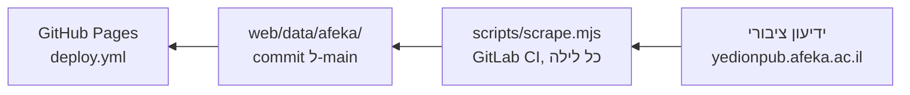

<div dir="rtl" lang="he">

# פיתוח: הרצה מקומית, בדיקות ונתונים

## הרצה מקומית

דרישות: Node.js 22 ומעלה (נבדק על 24) ו-Git. אין שלב build, האתר הוא קבצים סטטיים.

```bash
git clone https://github.com/dolev-benezri/lets_learn.git
cd lets_learn
npm ci
npx http-server web -p 8080 -c-1
```

פותחים את http://localhost:8080/. אם הפורט תפוס (`EADDRINUSE`), מחליפים ל-`-p 8081`. כל הפקודות רצות מתוך תיקיית הפרויקט.

## בדיקות

```bash
npm test
```

מריץ `node --test` על תיקיית `test/`: פרסור, בניית נתונים, הגדרות התוכניות, תקנון, חיפוש, שיתוף, מצב האפליקציה, הלוח ומדיניות האבטחה (CSP).

## זרימת הנתונים



1. **הגדרות:** [scripts/programs.json](../scripts/programs.json) מגדיר כל תוכנית: מחלקה, מחזורים, רשימות הקורסים של כל מחזור, התמחויות, כלל בחירת התמחות, נקודות זכות לתואר וקורס עוגן לבדיקה.
2. **משיכה ובנייה:** `scripts/scrape.mjs` עובר על הידיעון הציבורי (בלי התחברות), `parse.mjs` מפרסר את ה-HTML, `build.mjs` מאחד לפורמט אחד ומריץ `validate()`.
3. **כתיבה בטוחה:** קבצים נכתבים רק אם כל הבדיקות עוברות, וקובץ שלא השתנה לא נכתב מחדש. `validate()` דורש מספר מינימלי של קורסים ואת קורס העוגן בכל מחזור ובכל סמסטר. `status.json` מתעדכן בכל ריצה מוצלחת, והאתר קורא ממנו את שורת "נבדק לפני..." שבכותרת, ו-`catalog.json` קובע אילו תוכניות ומחזורים מוצגים.
4. **ריצה לילית:** [ci/gitlab-scrape.yml](../ci/gitlab-scrape.yml) רץ בתזמון של GitLab CI (השרתים של GitHub Actions לא מצליחים להתחבר לידיעון), מוסיף commit ודוחף ל-`main`. הודעת ה-commit היא שורת סיכום אחת, עם עד 6 קבצים ו-"ועוד N מתוך M קבצים".
5. **פריסה:** push ל-`main` שנוגע ב-`web/` מפעיל את [.github/workflows/deploy.yml](../.github/workflows/deploy.yml), שמפרסם את `web/` ב-GitHub Pages.

הנתונים נשמרים בקבצים `web/data/afeka/{שנה}-{סמסטר}/{תוכנית}-{מחזור}.json`, למשל `2027-1/30-2026.json`.

## משיכה ידנית

רק כשצריך, והיא פונה לאתר אמיתי:

לפי הסדר: תוכנית אחת (30) ומחזור אחד; תוכניות נבחרות; כל התוכניות; בנייה מהמטמון בלי אף בקשה.

```bash
node scripts/scrape.mjs --all-semesters
node scripts/scrape.mjs --all-semesters --all-programs --programs 20,30 --cache cache
node scripts/scrape.mjs --all-semesters --all-programs --cache cache
node scripts/scrape.mjs --all-semesters --all-programs --cache cache --offline
```

| דגל | ברירת מחדל | משמעות |
|---|---|---|
| `--year` | `2027` | שנה אקדמית (2027 = תשפ״ז) |
| `--semester` | `א` | `א`, `ב` או `קיץ` (נדרס על ידי `--all-semesters`) |
| `--program` | `30` | קוד תוכנית יחידה, לפי `programs.json` |
| `--start` | `2026` | שנת התחלת המחזור, לתוכנית יחידה |
| `--all-semesters` | כבוי | בונה כל סמסטר שיש לו מפגשים, במעבר אחד |
| `--programs` | | עם `--all-programs`: רק התוכניות ברשימה (מופרדת בפסיקים), לכל המחזורים שלהן |
| `--all-programs` | כבוי | כל התוכניות שב-`programs.json`, לכל המחזורים |
| `--cache` | | תיקייה ששומרת כל תשובה של האתר, כדי להמשיך ריצה שנעצרה או לבנות בלי רשת |
| `--offline` | כבוי | עם `--cache`: בונה רק מהמטמון, ושגיאה אם חסרה תשובה |
| `--nightly` | כבוי | עם `--cache`: בחינות נמשכות בכל ריצה, הקבוצות של כל קורס פעם בשני לילות (חצי מהקורסים בכל לילה), ורשימות, פרטי קורסים ודפי מסלול פעם בשבוע |
| `--wait-throttle` | כבוי | ממתין לשעה שבה נגמרת ההגבלה השעתית ואז ממשיך, במקום להיכשל |
| `--delay` | `2500` | השהיה במילישניות בין בקשות (±500 אקראי) |
| `--force` | כבוי | ממשיך גם כשבדיקת הבטיחות מול הנתונים הקודמים נכשלת |

אין `--help`: דגל לא מוכר גורם לשגיאה.

**נימוס כלפי האתר:** בקשה אחת בכל פעם, וההגבלה של האתר היא כ-400 בקשות בשעה. משיכה ראשונה של כל התוכניות היא כ-1,800 בקשות, ולכן היא נמשכת כמה שעות, וכל תשובה נשמרת במטמון. אחר כך הריצה הלילית היא כ-250 בקשות (חצי מהקבוצות, הבחינות וחלק מהשבועיות). ה-User-Agent הוא `afeka-scheduler/1.1 (+https://github.com/dolev-benezri/lets_learn)`. שלוש דחיות ברצף עוצרות את הריצה, `Retry-After` מכובד, ואז שום קובץ לא נכתב. פרטים ב-[התנאים](https://dolev-benezri.github.io/lets_learn/legal.html).

תפעול שוטף (ריצה לילית, טוקן, שנה חדשה, תוכנית חדשה): [OPERATIONS](OPERATIONS.md). מבנה הקוד: [ARCHITECTURE](ARCHITECTURE.md).

</div>
