# מפת דרישות קדם

נוצר אוטומטית מ-`web/data/afeka/2027-1/30-2026.json` (נתונים מ-2026-09-30) על ידי `node scripts/prereq-map.mjs`. לא לערוך ידנית.
גרסה אינטראקטיבית ומכונה-קריאה: [prereqs.json](prereqs.json).

- חץ מלא: **קדם** (חייבים לעבור קודם). חץ מקווקו: **מקביל** (אפשר באותו סמסטר).
- "או": כל אחת מהחלופות מספיקה.
- אפור: לא נלמד בסמסטר הנוכחי. צורה מעוגלת: קורס מחוץ לתוכנית.

```mermaid
flowchart LR
  subgraph L0["קורסי חובה שנה א'"]
    c10016["מבוא למדעי המחשב<br/>10016 · 4.5 נ״ז"]
    c30003["מבוא לכימיה<br/>30003 · 2.5 נ״ז"]
    c30130["גרפיקה הנדסית 1<br/>30130 · 3 נ״ז"]
    c30133["הנדסה למעשה<br/>30133 · 1.5 נ״ז"]
    c30135["סטטיקה של גוף קשיח<br/>30135 · 3.5 נ״ז"]
    c30137["תורת החומרים<br/>30137 · 3.5 נ״ז"]
    c90901["חשבון דיפרנציאלי אינטגרלי1<br/>90901 · 5 נ״ז"]
    c90902["חשבון דיפרנציאלי אינטגרלי2<br/>90902 · 5 נ״ז"]
    c90903["פיזיקה-מכניקה<br/>90903 · 5 נ״ז"]
    c90905["אלגברה ליניארית<br/>90905 · 5 נ״ז"]
    c90914["משוואות דיפ' רגילות<br/>90914 · 2.5 נ״ז"]
  end
  subgraph L1["קורסי חובה שנה ב'"]
    c10336["יישומי מחשב בהנדסה MATLAB<br/>10336 · 0.5 נ״ז"]
    c20816["מבוא להנדסת חשמל ואלקטרוניקה<br/>20816 · 3 נ״ז"]
    c30110["חוזק חומרים 2<br/>30110 · 2.5 נ״ז"]
    c30112["תרמודינמיקה 1<br/>30112 · 2.5 נ״ז"]
    c30113["תרמודינמיקה 2<br/>30113 · 2.5 נ״ז"]
    c30117["תורת הזרימה 1<br/>30117 · 3 נ״ז"]
    c30127["חוזק חומרים 1<br/>30127 · 3.5 נ״ז"]
    c30131["גרפיקה הנדסית 2<br/>30131 · 3 נ״ז"]
    c30136["דינמיקה של גוף קשיח<br/>30136 · 3.5 נ״ז"]
    c90904["פיזיקה חשמל ומגנטיות<br/>90904 · 5 נ״ז"]
    c90911["מבוא להסתברות<br/>90911 · 3.5 נ״ז"]
    c90915["משוואות דיפ' חלקיות<br/>90915 · 2.5 נ״ז"]
    c90916["אנליזה הרמונית<br/>90916 · 2.5 נ״ז"]
    c90917["פונקציות מרוכבות<br/>90917 · 2.5 נ״ז"]
    c90918["מעבדת פיזיקה מכניקה<br/>90918 · 1 נ״ז"]
    c90919["מעבדת פיזיקה חשמל<br/>90919 · 1 נ״ז"]
  end
  subgraph L2["קורסי חובה שנה ג'"]
    c30116["מערכות ליניאריות<br/>30116 · 2.5 נ״ז"]
    c30118["תורת הזרימה 2<br/>30118 · 3 נ״ז"]
    c30120["מעבר חום<br/>30120 · 3.5 נ״ז"]
    c30128["מעבדת חוזק חומרים ותכונות החומר<br/>30128 · 1.5 נ״ז"]
    c30160["מכשירי מדידה וחיישנים<br/>30160 · 2 נ״ז"]
    c30161["מעבדה לזרימה ומדידות<br/>30161 · 1.5 נ״ז"]
    c30163["מעבדת תהליכי ייצור<br/>30163 · 1 נ״ז"]
    c30164["תהליכי ייצור<br/>30164 · 2.5 נ״ז"]
    c30221["חלקי מכונות 1<br/>30221 · 3.5 נ״ז"]
    c30302["תורת הבקרה<br/>30302 · 2.5 נ״ז"]
    c30321["תכנות למכטרוניקה<br/>30321 · 3 נ״ז"]
    c30333["תיב'ם<br/>30333 · 3 נ״ז"]
    c90925["אנליזה נומרית<br/>90925 · 3.5 נ״ז"]
  end
  subgraph L3["קורסי חובה שנה ד'"]
    c30134["כלכלה הנדסית להנדסה מכנית<br/>30134 · 1.5 נ״ז"]
    c30308["תורת התנודות<br/>30308 · 3.5 נ״ז"]
  end
  subgraph L4["פרויקט גמר"]
    c30411["פרויקט גמר חלק א'<br/>30411 · 1 נ״ז"]
    c30422["פרויקט גמר חלק ב'<br/>30422 · 1 נ״ז"]
    c30423["פרויקט גמר חלק ג'<br/>30423 · 6 נ״ז"]
  end
  subgraph L5["נושא חובה נוסף"]
    c8080["לומדה למניעת הטרדה מינית-און ליין<br/>8080 · 0 נ״ז"]
  end
  subgraph L6["חטיבת יזמות"]
    c88101["התנעת המיזם הטכנולוגי<br/>88101 · 2 נ״ז"]
    c88102["מהפיתוח לשוק הגלובלי<br/>88102 · 2 נ״ז"]
  end
  subgraph L7["קורסי יחידה ללימודי חברה ורוח"]
    c80834["מושגי יסוד בפילוסופיה<br/>80834 · 2 נ״ז"]
    c80840["זהות עצמית בקולנוע ופילוסופיה<br/>80840 · 2 נ״ז"]
    c80874["Engineers Go to Maraket<br/>80874 · 2 נ״ז"]
    c80892["Engineers become Enterpreneurs<br/>80892 · 2 נ״ז"]
    c80909["Professional Writing in AI-Imbued Workpl<br/>80909 · 2 נ״ז"]
    c80912["סוגיות נבחרות באתיקה הנדסית<br/>80912 · 2 נ״ז"]
    c80919["Ethics in Engineering<br/>80919 · 2 נ״ז"]
    c80926["Gender Sexuality & Desire in Cyberspace<br/>80926 · 2 נ״ז"]
    c80932["מאמרי דעה - מתיאוריה לפרקטיקה<br/>80932 · 2 נ״ז"]
    c80935["אקזיסטנציאליזם: קריאה מודרכת<br/>80935 · 2 נ״ז"]
    c80940["Wonders of Human Language<br/>80940 · 2 נ״ז"]
    c80941["מערכת הבריאות בישראל<br/>80941 · 2 נ״ז"]
    c80946["תרבות ותודעה : מי מייצר את האני שלנו?<br/>80946 · 2 נ״ז"]
    c80947["Introduction to Research Methods<br/>80947 · 2 נ״ז"]
    c80948["היסטוריה ו-AI : אמריקה הלטינית במאה ה-20<br/>80948 · 2 נ״ז"]
    c80951["From Atomic Bomb to Green Nuclear Energy<br/>80951 · 2 נ״ז"]
    c80961["האדם הדיגיטלי בין אוטופיה לדיסטופיה<br/>80961 · 2 נ״ז"]
    c80963["קולנוע ופילוסופיה<br/>80963 · 2 נ״ז"]
    c80965["מח טכנולוגיה ובני אדם<br/>80965 · 2 נ״ז"]
    c80966["מי שולט במי<br/>80966 · 2 נ״ז"]
    c80967["ממציאים ומדענים ששינו את העולם<br/>80967 · 2 נ״ז"]
    c80970["פילוסופיה של מושג הקניין -למי שייך העולם<br/>80970 · 2 נ״ז"]
    c80971["סמינר ניהול מוצר בעולמות הבינה המלאכותית<br/>80971 · 2 נ״ז"]
    c80972["מודלי עולם מול LLMs - קו השבר הבא של AI<br/>80972 · 2 נ״ז"]
    c80973["קניין, חירות וחדשנות - למי שייך העתיד?<br/>80973 · 2 נ״ז"]
    c80974["כלכלת הבינה המלאכותית<br/>80974 · 2 נ״ז"]
    c80975["ממשקים אדפטיביים וחוויות מותאמות אישית<br/>80975 · 2 נ״ז"]
    c80976["הסברתיות ופרשנות של מודלים<br/>80976 · 2 נ״ז"]
    c80977["אינטליגנציה קולקטיבית: אדם, AI וקבוצות<br/>80977 · 2 נ״ז"]
  end
  subgraph L8["קורסי חובה לימודי אנגלית"]
    c6000["אנגלית טרום בסיסי (מכינה)<br/>6000 · 0 נ״ז"]
    c6001["אנגלית בסיסי (מתחילים)<br/>6001 · 0 נ״ז"]
    c6002["אנגלית מתקדמים א' (בינוניים)<br/>6002 · 0 נ״ז"]
    c6003["אנגלית מתקדמים ב' (מתקדמים)<br/>6003 · 0 נ״ז"]
  end
  c6000 -->|או| c6001
  x0 -->|או| c6001
  c6000 -->|או| c6001
  x1 -->|או| c6001
  c6001 --> c6002
  c6002 --> c6003
  c90905 --> c10336
  c90903 --> c20816
  c90904 -.-> c20816
  c30127 --> c30110
  c90901 --> c30112
  c30112 -->|או| c30113
  x2 -->|או| c30113
  c10336 --> c30116
  c90916 --> c30116
  c30135 -->|או| c30117
  x3 -->|או| c30117
  c30117 -->|או| c30118
  x4 -->|או| c30118
  c30112 -->|או| c30120
  x2 -->|או| c30120
  c90915 -.-> c30120
  c30135 --> c30127
  c30110 -.-> c30128
  c30127 --> c30128
  c30137 --> c30128
  c30130 -->|או| c30131
  x5 -->|או| c30131
  x6 --> c30134
  x7 -->|או| c30135
  x8 -->|או| c30135
  c90901 --> c30135
  c90903 -.-> c30135
  c30135 -->|או| c30136
  x3 -->|או| c30136
  c90901 --> c30136
  c90903 --> c30136
  c30112 --> c30160
  c90919 -.-> c30160
  c30112 --> c30161
  c30113 -.->|או| c30161
  x2 -.->|או| c30161
  c30118 --> c30161
  c30120 --> c30161
  c30160 -.-> c30161
  c30130 -->|או| c30163
  x5 -->|או| c30163
  c30137 --> c30163
  c30164 -.->|או| c30163
  c30164 -.->|או| c30163
  c30130 -->|או| c30164
  x5 -->|או| c30164
  c30137 --> c30164
  c30127 --> c30221
  c30137 --> c30221
  c30116 --> c30302
  c30136 --> c30308
  c90914 --> c30308
  c10016 -->|או| c30321
  c10016 -->|או| c30321
  c10016 -->|או| c30321
  x9 -->|או| c30321
  c30131 --> c30333
  c30221 -.-> c30333
  c30112 -->|או| c30411
  x2 -->|או| c30411
  c30117 -->|או| c30411
  x4 -->|או| c30411
  c30127 --> c30411
  c30131 --> c30411
  c30137 -.->|או| c30411
  x10 -.->|או| c30411
  c30333 -.->|או| c30411
  c30333 -.->|או| c30411
  c30411 -.-> c30422
  c30422 --> c30423
  x11 --> c80919
  c6002 --> c80940
  c88101 --> c88102
  c90901 --> c90902
  c90905 --> c90902
  x7 -->|או| c90903
  x8 -->|או| c90903
  c90903 --> c90904
  c90901 --> c90911
  c90902 -.-> c90914
  c90905 --> c90914
  c90916 --> c90915
  c90917 --> c90915
  c90902 --> c90916
  c90914 --> c90916
  c90914 --> c90917
  c90903 --> c90918
  c90904 --> c90919
  c90918 --> c90919
  c90902 --> c90925
  c90905 --> c90925
  c90914 -.-> c90925
  x0(["אנגלית - מכינה בדרך לאפקה<br/>מחוץ לתוכנית"])
  x1(["אנגלית1 - מכינה בדרך לאפקה<br/>מחוץ לתוכנית"])
  x2(["תרמודינמיקה<br/>מחוץ לתוכנית"])
  x3(["מכניקת המוצקים1<br/>מחוץ לתוכנית"])
  x4(["מכניקת הזורמים<br/>מחוץ לתוכנית"])
  x5(["גרפיקה הנדסית להנדסה רפואית<br/>מחוץ לתוכנית"])
  x6(["כלכלה הנדסית<br/>מחוץ לתוכנית"])
  x7(["קורס הכנה פיזיקה<br/>מחוץ לתוכנית"])
  x8(["פיזיקה - מכינה בדרך לאפקה<br/>מחוץ לתוכנית"])
  x9(["מבוא לתכנות פיתון<br/>מחוץ לתוכנית"])
  x10(["תורת החומרים 2<br/>מחוץ לתוכנית"])
  x11(["אתיקה בהנדסה<br/>מחוץ לתוכנית"])
  classDef off fill:#eee,stroke:#999,color:#555;
  class c6000,c8080,c30130,c30135,c30163,c30164,c30411,c30422,c30423,c80840,c80892,c80909,c80912,c80926,c80932,c80935,c80940,c80947,c80951,c80961,c80965,c80966,c80967,c80970,c80973,c80976,c80977,c88102,c90902 off;
```

## טבלה

"פותח" = כמה קורסים נחסמים בשרשרת (רק קדם). "עומק" = אורך השרשרת הארוכה ביותר שהקורס פותח.

| קוד | קורס | רשימה | נ״ז | נלמד | דורש (קדם) | מקביל | פותח ישירות | פותח בסך הכל | עומק |
|---|---|---|---|---|---|---|---|---|---|
| 90901 | חשבון דיפרנציאלי אינטגרלי1 | קורסי חובה שנה א' | 5 | כן | — | — | 30112, 30135, 30136, 90902, 90911 | 22 | 4 |
| 30135 | סטטיקה של גוף קשיח | קורסי חובה שנה א' | 3.5 | לא | (קורס הכנה פיזיקה) או (פיזיקה - מכינה בדרך לאפקה); 90901 | 90903 | 30117, 30127, 30136 | 10 | 3 |
| 90905 | אלגברה ליניארית | קורסי חובה שנה א' | 5 | כן | — | — | 10336, 90902, 90914, 90925 | 10 | 4 |
| 90903 | פיזיקה-מכניקה | קורסי חובה שנה א' | 5 | כן | (קורס הכנה פיזיקה) או (פיזיקה - מכינה בדרך לאפקה) | — | 20816, 30136, 90904, 90918 | 6 | 2 |
| 90914 | משוואות דיפ' רגילות | קורסי חובה שנה א' | 2.5 | כן | 90905 | 90902 | 30308, 90916, 90917 | 6 | 3 |
| 30112 | תרמודינמיקה 1 | קורסי חובה שנה ב' | 2.5 | כן | 90901 | — | 30113, 30120, 30160, 30161, 30411 | 5 | 2 |
| 30130 | גרפיקה הנדסית 1 | קורסי חובה שנה א' | 3 | לא | — | — | 30131, 30163, 30164 | 5 | 2 |
| 90902 | חשבון דיפרנציאלי אינטגרלי2 | קורסי חובה שנה א' | 5 | לא | 90901; 90905 | — | 90916, 90925 | 5 | 3 |
| 30127 | חוזק חומרים 1 | קורסי חובה שנה ב' | 3.5 | כן | 30135 | — | 30110, 30128, 30221, 30411 | 4 | 1 |
| 30137 | תורת החומרים | קורסי חובה שנה א' | 3.5 | כן | — | — | 30128, 30163, 30164, 30221 | 4 | 1 |
| 6000 | אנגלית טרום בסיסי (מכינה) | קורסי חובה לימודי אנגלית | 0 | לא | — | — | 6001 | 4 | 3 |
| 30117 | תורת הזרימה 1 | קורסי חובה שנה ב' | 3 | כן | 30135 או (מכניקת המוצקים1) | — | 30118, 30411 | 3 | 2 |
| 6001 | אנגלית בסיסי (מתחילים) | קורסי חובה לימודי אנגלית | 0 | כן | 6000 או (אנגלית - מכינה בדרך לאפקה); 6000 או (אנגלית1 - מכינה בדרך לאפקה) | — | 6002 | 3 | 2 |
| 90916 | אנליזה הרמונית | קורסי חובה שנה ב' | 2.5 | כן | 90902; 90914 | — | 30116, 90915 | 3 | 2 |
| 10336 | יישומי מחשב בהנדסה MATLAB | קורסי חובה שנה ב' | 0.5 | כן | 90905 | — | 30116 | 2 | 2 |
| 30131 | גרפיקה הנדסית 2 | קורסי חובה שנה ב' | 3 | כן | 30130 או (גרפיקה הנדסית להנדסה רפואית) | — | 30333, 30411 | 2 | 1 |
| 6002 | אנגלית מתקדמים א' (בינוניים) | קורסי חובה לימודי אנגלית | 0 | כן | 6001 | — | 6003, 80940 | 2 | 1 |
| 10016 | מבוא למדעי המחשב | קורסי חובה שנה א' | 4.5 | כן | — | — | 30321 | 1 | 1 |
| 30116 | מערכות ליניאריות | קורסי חובה שנה ג' | 2.5 | כן | 10336; 90916 | — | 30302 | 1 | 1 |
| 30118 | תורת הזרימה 2 | קורסי חובה שנה ג' | 3 | כן | 30117 או (מכניקת הזורמים) | — | 30161 | 1 | 1 |
| 30120 | מעבר חום | קורסי חובה שנה ג' | 3.5 | כן | 30112 או (תרמודינמיקה) | 90915 | 30161 | 1 | 1 |
| 30136 | דינמיקה של גוף קשיח | קורסי חובה שנה ב' | 3.5 | כן | 30135 או (מכניקת המוצקים1); 90901; 90903 | — | 30308 | 1 | 1 |
| 30422 | פרויקט גמר חלק ב' | פרויקט גמר | 1 | לא | — | 30411 | 30423 | 1 | 1 |
| 88101 | התנעת המיזם הטכנולוגי | חטיבת יזמות | 2 | כן | — | — | 88102 | 1 | 1 |
| 90904 | פיזיקה חשמל ומגנטיות | קורסי חובה שנה ב' | 5 | כן | 90903 | — | 90919 | 1 | 1 |
| 90917 | פונקציות מרוכבות | קורסי חובה שנה ב' | 2.5 | כן | 90914 | — | 90915 | 1 | 1 |
| 90918 | מעבדת פיזיקה מכניקה | קורסי חובה שנה ב' | 1 | כן | 90903 | — | 90919 | 1 | 1 |
| 20816 | מבוא להנדסת חשמל ואלקטרוניקה | קורסי חובה שנה ב' | 3 | כן | 90903 | 90904 | — | 0 | 0 |
| 30003 | מבוא לכימיה | קורסי חובה שנה א' | 2.5 | כן | — | — | — | 0 | 0 |
| 30110 | חוזק חומרים 2 | קורסי חובה שנה ב' | 2.5 | כן | 30127 | — | — | 0 | 0 |
| 30113 | תרמודינמיקה 2 | קורסי חובה שנה ב' | 2.5 | כן | 30112 או (תרמודינמיקה) | — | — | 0 | 0 |
| 30128 | מעבדת חוזק חומרים ותכונות החומר | קורסי חובה שנה ג' | 1.5 | כן | 30127; 30137 | 30110 | — | 0 | 0 |
| 30133 | הנדסה למעשה | קורסי חובה שנה א' | 1.5 | כן | — | — | — | 0 | 0 |
| 30134 | כלכלה הנדסית להנדסה מכנית | קורסי חובה שנה ד' | 1.5 | כן | (כלכלה הנדסית) | — | — | 0 | 0 |
| 30160 | מכשירי מדידה וחיישנים | קורסי חובה שנה ג' | 2 | כן | 30112 | 90919 | — | 0 | 0 |
| 30161 | מעבדה לזרימה ומדידות | קורסי חובה שנה ג' | 1.5 | כן | 30112; 30118; 30120 | 30113 או (תרמודינמיקה); 30160 | — | 0 | 0 |
| 30163 | מעבדת תהליכי ייצור | קורסי חובה שנה ג' | 1 | לא | 30130 או (גרפיקה הנדסית להנדסה רפואית); 30137 | 30164 או 30164 | — | 0 | 0 |
| 30164 | תהליכי ייצור | קורסי חובה שנה ג' | 2.5 | לא | 30130 או (גרפיקה הנדסית להנדסה רפואית); 30137 | — | — | 0 | 0 |
| 30221 | חלקי מכונות 1 | קורסי חובה שנה ג' | 3.5 | כן | 30127; 30137 | — | — | 0 | 0 |
| 30302 | תורת הבקרה | קורסי חובה שנה ג' | 2.5 | כן | 30116 | — | — | 0 | 0 |
| 30308 | תורת התנודות | קורסי חובה שנה ד' | 3.5 | כן | 30136; 90914 | — | — | 0 | 0 |
| 30321 | תכנות למכטרוניקה | קורסי חובה שנה ג' | 3 | כן | 10016 או 10016; 10016 או (מבוא לתכנות פיתון) | — | — | 0 | 0 |
| 30333 | תיב"ם | קורסי חובה שנה ג' | 3 | כן | 30131 | 30221 | — | 0 | 0 |
| 30411 | פרויקט גמר חלק א' | פרויקט גמר | 1 | לא | 30112 או (תרמודינמיקה); 30117 או (מכניקת הזורמים); 30127; 30131 | 30137 או (תורת החומרים 2); 30333 או 30333 | — | 0 | 0 |
| 30423 | פרויקט גמר חלק ג' | פרויקט גמר | 6 | לא | 30422 | — | — | 0 | 0 |
| 6003 | אנגלית מתקדמים ב' (מתקדמים) | קורסי חובה לימודי אנגלית | 0 | כן | 6002 | — | — | 0 | 0 |
| 8080 | לומדה למניעת הטרדה מינית-און ליין | נושא חובה נוסף | 0 | לא | — | — | — | 0 | 0 |
| 80834 | מושגי יסוד בפילוסופיה | קורסי יחידה ללימודי חברה ורוח | 2 | כן | — | — | — | 0 | 0 |
| 80840 | זהות עצמית בקולנוע ופילוסופיה | קורסי יחידה ללימודי חברה ורוח | 2 | לא | — | — | — | 0 | 0 |
| 80874 | Engineers Go to Maraket | קורסי יחידה ללימודי חברה ורוח | 2 | כן | — | — | — | 0 | 0 |
| 80892 | Engineers become Enterpreneurs | קורסי יחידה ללימודי חברה ורוח | 2 | לא | — | — | — | 0 | 0 |
| 80909 | Professional Writing in AI-Imbued Workpl | קורסי יחידה ללימודי חברה ורוח | 2 | לא | — | — | — | 0 | 0 |
| 80912 | סוגיות נבחרות באתיקה הנדסית | קורסי יחידה ללימודי חברה ורוח | 2 | לא | — | — | — | 0 | 0 |
| 80919 | Ethics in Engineering | קורסי יחידה ללימודי חברה ורוח | 2 | כן | (אתיקה בהנדסה) | — | — | 0 | 0 |
| 80926 | Gender Sexuality & Desire in Cyberspace | קורסי יחידה ללימודי חברה ורוח | 2 | לא | — | — | — | 0 | 0 |
| 80932 | מאמרי דעה - מתיאוריה לפרקטיקה | קורסי יחידה ללימודי חברה ורוח | 2 | לא | — | — | — | 0 | 0 |
| 80935 | אקזיסטנציאליזם: קריאה מודרכת | קורסי יחידה ללימודי חברה ורוח | 2 | לא | — | — | — | 0 | 0 |
| 80940 | Wonders of Human Language | קורסי יחידה ללימודי חברה ורוח | 2 | לא | 6002 | — | — | 0 | 0 |
| 80941 | מערכת הבריאות בישראל | קורסי יחידה ללימודי חברה ורוח | 2 | כן | — | — | — | 0 | 0 |
| 80946 | תרבות ותודעה : מי מייצר את האני שלנו? | קורסי יחידה ללימודי חברה ורוח | 2 | כן | — | — | — | 0 | 0 |
| 80947 | Introduction to Research Methods | קורסי יחידה ללימודי חברה ורוח | 2 | לא | — | — | — | 0 | 0 |
| 80948 | היסטוריה ו-AI : אמריקה הלטינית במאה ה-20 | קורסי יחידה ללימודי חברה ורוח | 2 | כן | — | — | — | 0 | 0 |
| 80951 | From Atomic Bomb to Green Nuclear Energy | קורסי יחידה ללימודי חברה ורוח | 2 | לא | — | — | — | 0 | 0 |
| 80961 | האדם הדיגיטלי בין אוטופיה לדיסטופיה | קורסי יחידה ללימודי חברה ורוח | 2 | לא | — | — | — | 0 | 0 |
| 80963 | קולנוע ופילוסופיה | קורסי יחידה ללימודי חברה ורוח | 2 | כן | — | — | — | 0 | 0 |
| 80965 | מח טכנולוגיה ובני אדם | קורסי יחידה ללימודי חברה ורוח | 2 | לא | — | — | — | 0 | 0 |
| 80966 | מי שולט במי | קורסי יחידה ללימודי חברה ורוח | 2 | לא | — | — | — | 0 | 0 |
| 80967 | ממציאים ומדענים ששינו את העולם | קורסי יחידה ללימודי חברה ורוח | 2 | לא | — | — | — | 0 | 0 |
| 80970 | פילוסופיה של מושג הקניין -למי שייך העולם | קורסי יחידה ללימודי חברה ורוח | 2 | לא | — | — | — | 0 | 0 |
| 80971 | סמינר ניהול מוצר בעולמות הבינה המלאכותית | קורסי יחידה ללימודי חברה ורוח | 2 | כן | — | — | — | 0 | 0 |
| 80972 | מודלי עולם מול LLMs - קו השבר הבא של AI | קורסי יחידה ללימודי חברה ורוח | 2 | כן | — | — | — | 0 | 0 |
| 80973 | קניין, חירות וחדשנות - למי שייך העתיד? | קורסי יחידה ללימודי חברה ורוח | 2 | לא | — | — | — | 0 | 0 |
| 80974 | כלכלת הבינה המלאכותית | קורסי יחידה ללימודי חברה ורוח | 2 | כן | — | — | — | 0 | 0 |
| 80975 | ממשקים אדפטיביים וחוויות מותאמות אישית | קורסי יחידה ללימודי חברה ורוח | 2 | כן | — | — | — | 0 | 0 |
| 80976 | הסברתיות ופרשנות של מודלים | קורסי יחידה ללימודי חברה ורוח | 2 | לא | — | — | — | 0 | 0 |
| 80977 | אינטליגנציה קולקטיבית: אדם, AI וקבוצות | קורסי יחידה ללימודי חברה ורוח | 2 | לא | — | — | — | 0 | 0 |
| 88102 | מהפיתוח לשוק הגלובלי | חטיבת יזמות | 2 | לא | 88101 | — | — | 0 | 0 |
| 90911 | מבוא להסתברות | קורסי חובה שנה ב' | 3.5 | כן | 90901 | — | — | 0 | 0 |
| 90915 | משוואות דיפ' חלקיות | קורסי חובה שנה ב' | 2.5 | כן | 90916; 90917 | — | — | 0 | 0 |
| 90919 | מעבדת פיזיקה חשמל | קורסי חובה שנה ב' | 1 | כן | 90904; 90918 | — | — | 0 | 0 |
| 90925 | אנליזה נומרית | קורסי חובה שנה ג' | 3.5 | כן | 90902; 90905 | 90914 | — | 0 | 0 |
