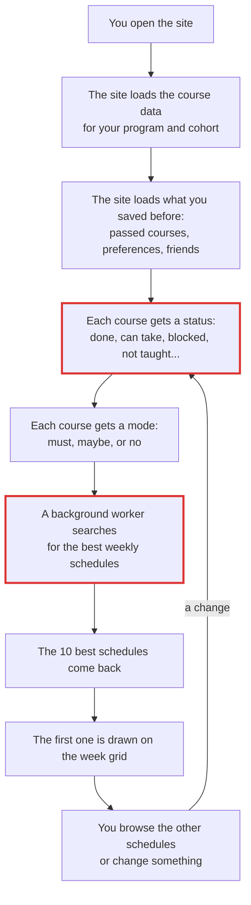
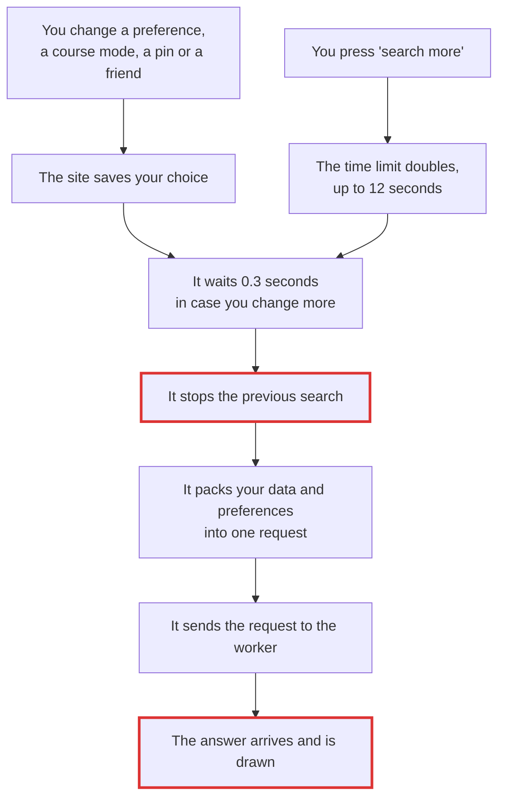
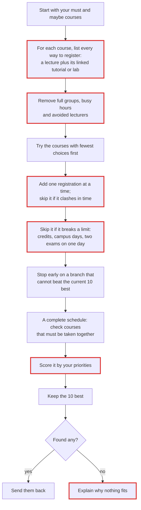
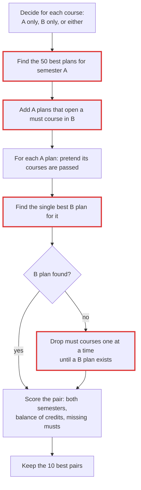
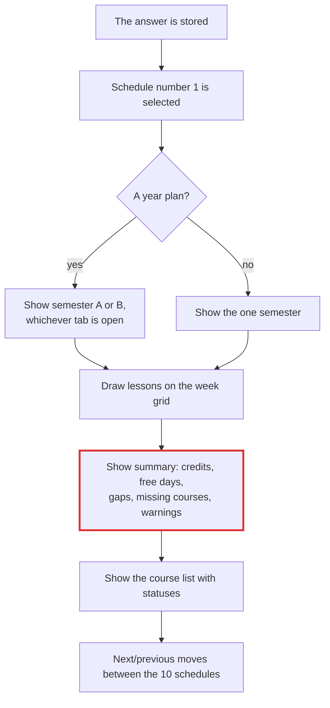

# How a schedule is made: from your choices to the week on screen

Five small diagrams, read top to bottom. Each box is one step. The file and line under each diagram tell you where it happens in the code, if you want to look.
Boxes with a red border have a known problem (see `findings.md`, ids in brackets).

## 1. The big picture

Where: page start `web/app.js:287-312`, statuses `web/rules.js:61-126`, modes `web/app.js:180`, worker `web/ui-search.js:33`, drawing `web/ui-view.js:52-143`.
Known problems: some mandatory courses are blocked forever by bad data [F-03]; the search can show an old answer after a change [F-02].

## 2. What starts a new search

Where: change handler `web/ui-plan.js:69-78`, wait `web/ui-search.js:8-16`, request `web/ui-search.js:17-41`, 'search more' `web/ui-actions.js:64-70`.
Known problem [F-02]: during the 0.3-second wait the old search is still running; if it answers then, its out-of-date schedule is drawn, and after a program switch the page breaks until the next answer.

## 3. Searching one semester

Where: `search` `web/solver-core.js:248-373`; registrations `buildOptions` `:54-102`; time check on a 30-minute grid `:4-44`; limits `:350-356`; early stop `:281-322`, `:348`; score `metrics` `:171-220`; explanation `diagnose` `:232-245`.
What was proven right: for the same input, this search returns exactly the same 10 schedules as trying every combination (1,200 test cases, 500 of them on real data).
Known problems: a course whose only lab is full gets no registration at all [F-01]; times are rounded to half hours, so busy blocks and 'not after' times that are not on :00 or :30 give wrong clashes [F-04, F-05]; a credit limit of 0 means 'no limit' [F-07]; 'prefer this lecturer' can remove every schedule [F-08]; Friday is never counted as a free day [F-13]; the 'why nothing fits' text can name the wrong cause [F-16].

## 4. Planning a whole year (semester A + semester B)

Where: `searchYear` `web/solver-core.js:382-501`.
What was proven right: every returned pair is valid (no clash, prerequisites in order, credits and missing courses correct) and its score matches the formula, on 300 synthetic and 130 real-data pairs.
Known problems [F-11, F-12]: the B plan is picked by the B score alone, so a better year can be missed (175 of 1,752 cases); the 50-plan cut and the 'open a must course' step can each lose the plan that takes a must course.

## 5. Showing the result

Where: store `web/ui-search.js:35`, select `web/ui-common.js:33-35`, split a year pair `web/ui-grid.js:120-124`, grid `web/ui-grid.js:187-207`, page `web/ui-view.js:52-143`, list `web/ui-side.js:58-88`, next/previous `web/ui-view.js:155-160`.
Known problem [F-13]: a week with Sunday to Thursday busy and Friday free says 'no free day'.
